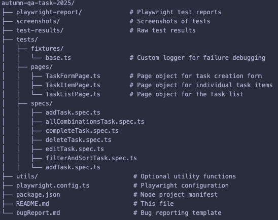

Autumn QA Task Automation

This project contains an end-to-end automation suite for testing the Autumn QA Task 2025 web application using Playwright.
The tests cover task creation, editing, deletion, filtering, and sorting.

⸻

🧰 Project Structure

⸻

⚙️ Prerequisites

Make sure you have installed:
	•	Node.js 18+

⸻

📦 Install Dependencies

npm install

This will install Playwright and required packages.

⸻

🎬 Run Tests
Run all tests:

    npx playwright test

Run a specific test file:

    npx playwright test tests/specs/addTask.spec.ts

Open Playwright Test UI (interactive mode):

    npx playwright test --ui

Run tests with custom commands:

    npm run test          # Run all tests with server start
    npm run test:smoke    # Run only smoke tests
    npm run test:regression # Run only regression tests

⸻

🖥️ Start App Manually
Clone the forked repository.
Change to the app folder:

    cd autumn-qa-task-2025/autumn-qa-task-2025

Install dependencies:

    npm install

Start the app:

    npm run dev

⸻

📝 Page Objects

The automation follows the Page Object Model:
	•	TaskFormPage: Handles adding tasks and verifying the task creation form.
	•	TaskItemPage: Handles interactions with individual tasks (complete, uncomplete, edit, delete).
	•	TaskListPage: Handles the task list, filtering, sorting, and verifying multiple tasks.

All page objects include debug logs on failure for easy troubleshooting.

⸻

📂 Screenshots

Failed tasks can optionally be captured using:

await taskListPage.screenshotTask('Task Title');

Screenshots are saved in the screenshots/ folder.

⸻

🧪 Test Coverage by Spec File
	•	addTask.spec.ts → Adding tasks with various data combinations.
	•	allCombinationsTask.spec.ts → Testing all possible combinations of task fields.
	•	completeTask.spec.ts → Completing and uncompleting tasks.
	•	deleteTask.spec.ts → Deleting tasks and verifying removal.
	•	editTask.spec.ts → Editing tasks and verifying the edit form prefill.
	•	filterAndSortTask.spec.ts → Filtering tasks by label and sorting by importance.

⸻

📌 Notes
	•	Tests use dynamic waits and selectors by role for stable automation.
	•	Task titles are automatically capitalized when added.
	•	Console logs appear only if a test fails, for easier debugging.

⸻

✅ Contributing
	•	Follow the Page Object Model for new pages or components.
	•	Use debug logs for troubleshooting intermittent failures.
	•	Screenshots are optional but recommended for visual validation.

⸻

📖 References
	•	Playwright Documentation
	•	Playwright Test Assertions
