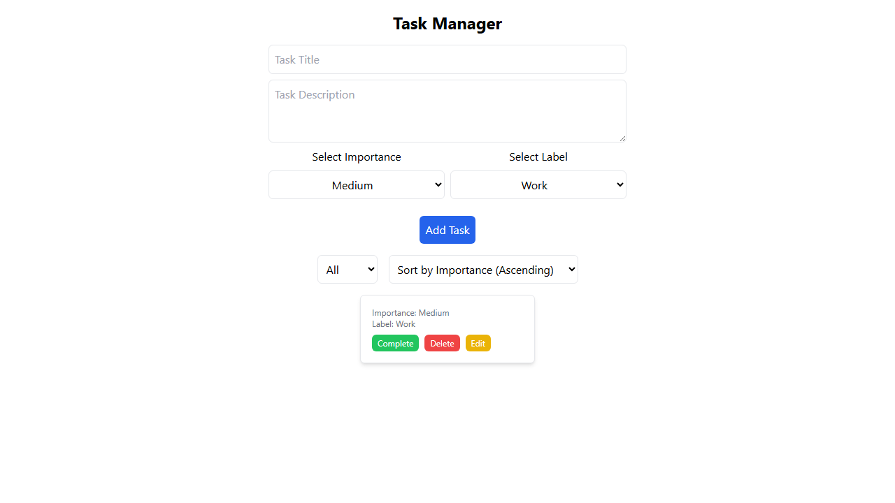
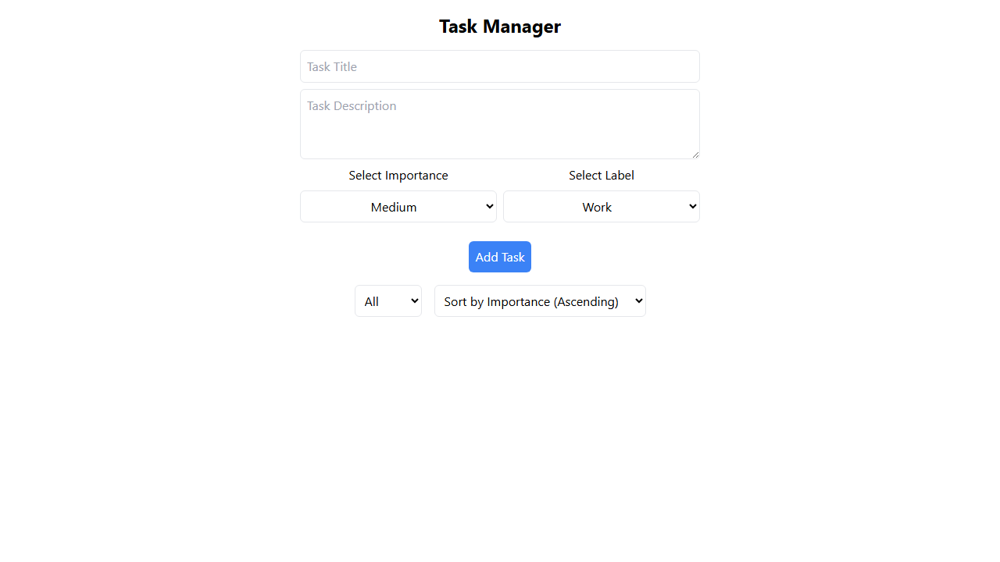
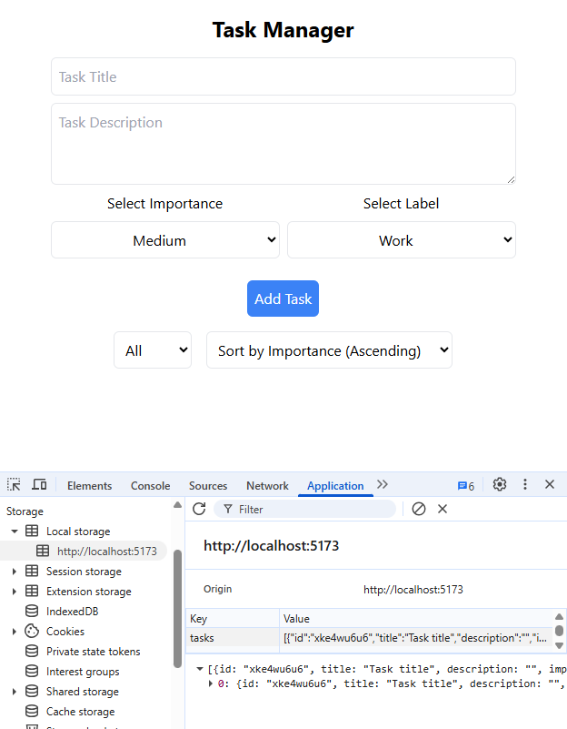
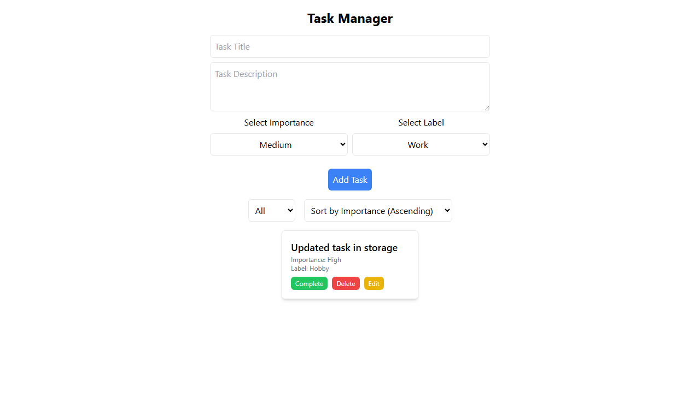
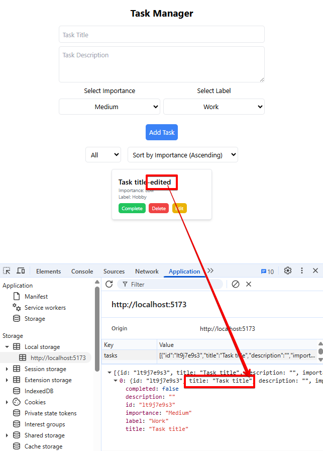

# Bug Report - Task Manager Application

## Executive Summary

During automated and manual testing of the Task Manager application, **6 bugs** were identified that affect core functionality and user experience. These bugs impact data validation, persistence, sorting, and UI/UX. All bugs are reproducible and have been captured with screenshots and detailed error logs.

### Bug Summary

| Bug # | Title | Severity | Priority | Type | Status | Tests Affected |
|-------|-------|----------|----------|------|--------|----------------|
| #1 | Missing title validation | Critical | High | Functional | Open | 1 test |
| #2 | localStorage not updated after deletion | Critical | High | Functional | Open | 1 test |
| #3 | localStorage not updated after editing | Critical | High | Functional | Open | 1 test |
| #4 | Incorrect cursor icon on Add Task button | Medium | Medium | UX/UI | Open | N/A (manual) |
| #5 | Completion state not persisted in localStorage | Critical | High | Functional | Open | 1 test |
| #6 | **Sort by importance not working** | **Critical** | **High** | **Functional** | **Open** | **9/11 tests** |

### Impact Analysis
- **Critical Bugs:** 5 (localStorage persistence issues + validation + sort)
- **UX Bugs:** 1 (cursor icon)
- **Functional Bugs:** 5
- **Data Integrity Issues:** 4 (validation + 3 localStorage bugs)
- **Complete Feature Failures:** 1 (sort functionality - 100% broken)

### Root Cause Patterns

**Pattern #1: localStorage Synchronization Failure**
- Bugs #2, #3, and #5 suggest a systematic issue with localStorage synchronization
- UI state updates are not being persisted to storage
- Affects: Delete, Edit, and Mark Complete operations

**Pattern #2: Complete Feature Non-Implementation**
- Bug #6 shows 100% test failure rate (9/9 verification tests)
- Sort functionality appears to be completely non-functional
- Suggests missing implementation or broken event handlers

## Bug Details

### Bug #1: Missing title validation

**Severity:** Critical  
**Priority:** High  
**Component:** Task Form Validation  
**Test:** `should not add task without title (negative test)`

#### Description
The application allows users to add tasks without providing a title, despite the requirement that "Title and Importance are required" as stated in the product requirements.

#### Steps to Reproduce
1. Navigate to the Task Manager application
2. Leave the "Task Title" field empty
3. Leave the importance level as "Medium"
4. Click "Add Task" button

#### Expected Behavior
- The application should prevent task creation
- An error message should be displayed
- No task should be added to the task list
- Task count should remain unchanged

#### Actual Behavior
- Task is successfully created and added to the list
- No validation error is shown
- Task appears in the UI with an empty title
- Task count increases by 1

#### Evidence
- **Screenshot:** 

#### Impact
- **Data Integrity:** Invalid data is stored in the application
- **User Experience:** Confusing behavior contradicts stated requirements
- **Business Logic:** Core validation rules are not enforced

---

### Bug #2: localStorage not updated after task deletion

**Severity:** Critical  
**Priority:** High  
**Component:** Data Persistence  
**Test:** `should remove task from localStorage after deletion`

#### Description
When a task is deleted from the UI, it is not properly removed from localStorage, causing data inconsistency between the UI state and persistent storage.

#### Steps to Reproduce
1. Add a task to the application
2. Verify the task appears in both UI and localStorage
3. Delete the task using the "Delete" button
4. Refresh the page
5. Check localStorage contents

#### Expected Behavior
- Task should be removed from both UI and localStorage
- localStorage should contain 0 tasks after deletion
- Data consistency should be maintained

#### Actual Behavior
- Task is removed from UI, but reapers after page refresh
- Task remains in localStorage
- Data inconsistency between UI and storage

#### Evidence
- **Screenshot#1:** 
- **Screenshot#2:** 

#### Impact
- **Data Persistence:** Inconsistent state between UI and storage
- **User Experience:** Tasks may reappear after page refresh
- **Data Integrity:** Orphaned data in localStorage

---

### Bug #3: localStorage not updated after task editing

**Severity:** Critical  
**Priority:** High  
**Component:** Data Persistence  
**Test:** `should update localStorage after editing`

#### Description
When a task is edited in the UI, the changes are not properly reflected in localStorage, causing the updated task data to be lost on page refresh.

#### Steps to Reproduce
1. Add a task to the application
2. Edit the task (change title, importance, or label)
3. Save the changes
4. Refresh the page
5. Check localStorage contents

#### Expected Behavior
- Task should be updated in both UI and localStorage
- localStorage should contain the updated task data
- Changes should persist after page refresh

#### Actual Behavior
- Task is updated in UI
- localStorage still contains original task data
- Changes are lost on page refresh

#### Evidence
- **Screenshot#1:** 
- **Screenshot#2:** 
- **Error Log:** `Expected: defined, Received: undefined` - Updated task not found in localStorage
- **Test Location:** `edit-task.spec.ts:238`

#### Impact
- **Data Persistence:** Changes are not saved to storage
- **User Experience:** Data loss on page refresh
- **Data Integrity:** UI and storage are out of sync

---

### Bug #4: Incorrect Cursor Icon on Add Task Button - UX Issue

**Severity:** Medium  
**Priority:** Medium  
**Component:** User Interface / Task Form  
**Test Type:** Manual Testing

#### Description
**After the first task is created**, when the user hovers over the "Add Task" button, a "not-allowed" cursor (stop/prohibition symbol) is displayed instead of the standard pointer cursor. This creates confusion as it suggests the button is disabled or cannot be clicked, even when it is fully functional.

#### Steps to Reproduce
1. Navigate to the Task Manager application
2. Make sure that at least one task exists
4. Fill in the task form with valid data (e.g., Title: "New Task")
3. Click on the "Add Task" button
3. Move the mouse cursor over the "Add Task" button
4. Observe the cursor icon

#### Expected Behavior
- The cursor should change to a **pointer** (hand) icon when hovering over the "Add Task" button
- This is the standard behavior for clickable buttons and indicates interactivity
- The cursor should communicate that the button is clickable and active

#### Actual Behavior
- The cursor changes to a **not-allowed** (stop/prohibition symbol) icon
- This suggests the button is disabled or that the action is not permitted
- Creates user confusion about whether the button can be clicked

#### Evidence
- **Manual Testing Observation:** Cursor icon changes to "not-allowed" symbol
- **Browser:** All major browsers (Chrome, Firefox, Edge)
- **CSS Issue:** Likely caused by `cursor: not-allowed` style being applied to the button

#### Impact
- **User Experience:** Confusing visual feedback contradicts button functionality
- **Usability:** Users may hesitate to click the button or think it's disabled
- **UI Consistency:** Inconsistent with standard web UI patterns
- **Accessibility:** May confuse users relying on visual cues for interaction

---

### Bug #5: Completion state not persisted in localStorage

**Severity:** Critical  
**Priority:** High  
**Component:** Data Persistence / Task Completion  
**Test:** `should persist completion state in localStorage`

#### Description
When a task is marked as complete using the "Complete" button, the completion state is updated in the UI but not saved to localStorage. This causes the completion state to be lost when the page is refreshed.

#### Steps to Reproduce
1. Navigate to the Task Manager application
2. Add a new task (e.g., "Persistent task")
3. Click the "Complete" button to mark the task as complete
4. Verify the task shows as completed in the UI (green background)
5. Open browser DevTools → Application → Local Storage
6. Check the value of the "tasks" key
7. Alternatively, refresh the page

#### Expected Behavior
- Task completion state should be saved to localStorage
- The task's `completed` property should be `true` in localStorage
- After page refresh, the task should still appear as completed
- Data should be consistent between UI and storage

#### Actual Behavior
- Task appears as completed in the UI (visual feedback works)
- localStorage is not updated with the completion state
- After page refresh, the task appears as incomplete
- Data inconsistency between UI state and persistent storage

#### Evidence
- **Screenshot#1:** 

#### Related Bugs
- Bug #2: localStorage not updated after task deletion
- Bug #3: localStorage not updated after task editing
- Pattern: All data mutations fail to persist to localStorage

---

### Bug #6: Sort by importance functionality not working

**Severity:** Critical  
**Priority:** High

#### Description
The "Sort by Importance" feature is completely non-functional. When users select either ascending or descending sort order from the dropdown, tasks remain in their original order instead of being sorted by importance level (High, Medium, Low). This affects 100% of sort-related functionality.

#### Steps to Reproduce
1. Navigate to the Task Manager application
2. Add multiple tasks with different importance levels:
   - "High priority task" with importance: High
   - "Medium priority task" with importance: Medium
   - "Low priority task" with importance: Low
3. Click on the "Sort by Importance" dropdown
4. Select "Sort by Importance (Ascending)" or "(Descending)"
5. Observe the task order

#### Expected Behavior
**Ascending Order:**
- First: Low priority task
- Second: Medium priority task
- Third: High priority task

**Descending Order:**
- First: High priority task
- Second: Medium priority task
- Third: Low priority task

#### Actual Behavior
- Tasks remain in their original creation order
- Sort dropdown selection has no effect on task display order
- Behavior is consistent across all test scenarios

#### Evidence
**Test Results:** 9/11 tests failed (100% failure rate for sort verification tests)

---